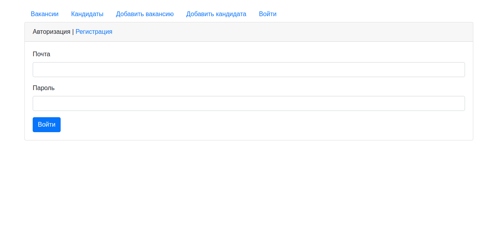
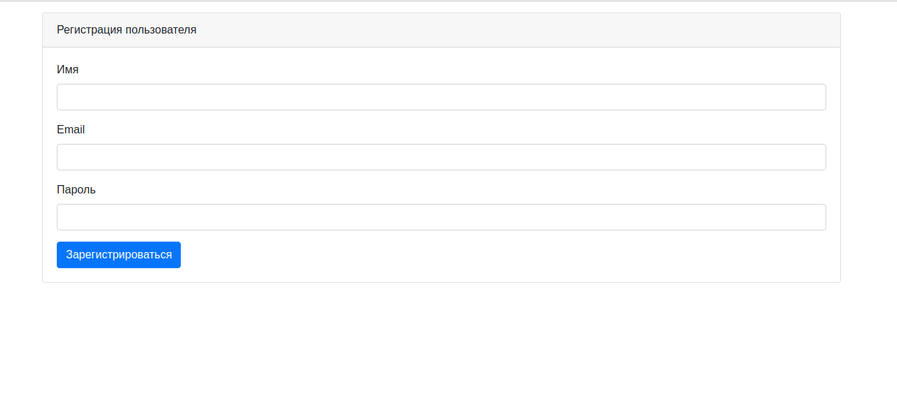
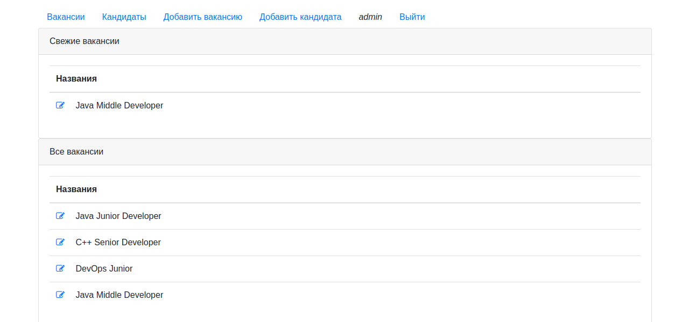
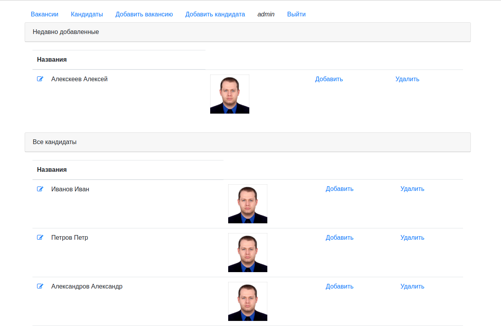
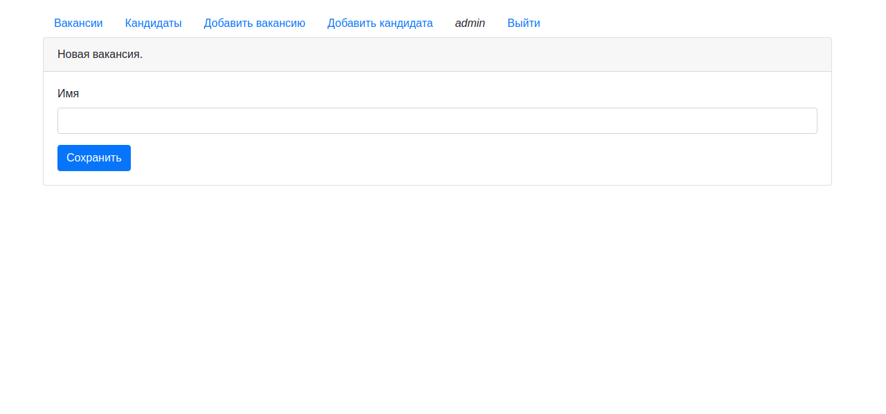
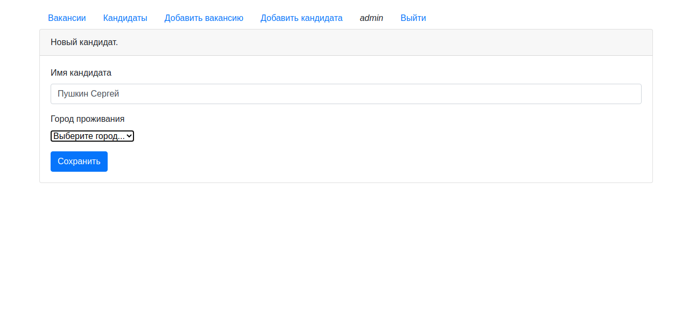

# Приложение Dream Job

## О проекте
#### Описание
Web-Приложение для поиска работы. Позволяет размещать вакансии и резюме соискателей.
Предусмотрена регистрация пользователей. Кандидаты при размещении резюме могут загружать свои фотографии.
В качестве хранилища используется база данных Postgresql, отображение страниц - JSP, Servlet, HTML шаблоны Bootstrap.
В JSP используется библиотека тегов JSTL.
 
#### Технологии
>JDK14, Maven, Servlet, PostgreSQL, JSTL, JS, AJAX, Mockito
## Сборка
0. Скачайте исходники 
1. Создайте базу данных в соответствии с настройками, указанными в файле *db.properties*. 
   Файл находится в корневой директории.
2. Выполните сборку проекта: `mvn install`
3. Скопируйте полученный файл *target/mvn-webapp-test.war* на свой сервер

## Как пользоваться
Чтобы начать работать с приложением необходимо авторизоваться или зарегистрироваться:

После авторизации пользователь попадает на главную страницу, на которой располагается подборка свежих вакансий:

Навигация по приложению реализована через верхнее меню.
Посмотреть кандидатов, а также добавить резюме или разместить вакансию можно через соответствующий пункт меню:

## Контакты
Кутявин Владимир

skype: tribuna87

email: tribuna87@mail.ru

telegram: @kutiavinvladimir

